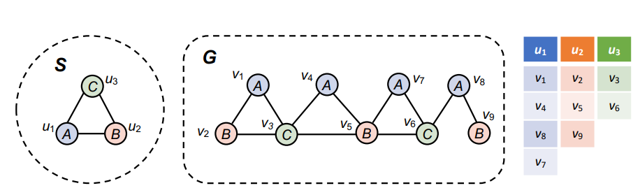
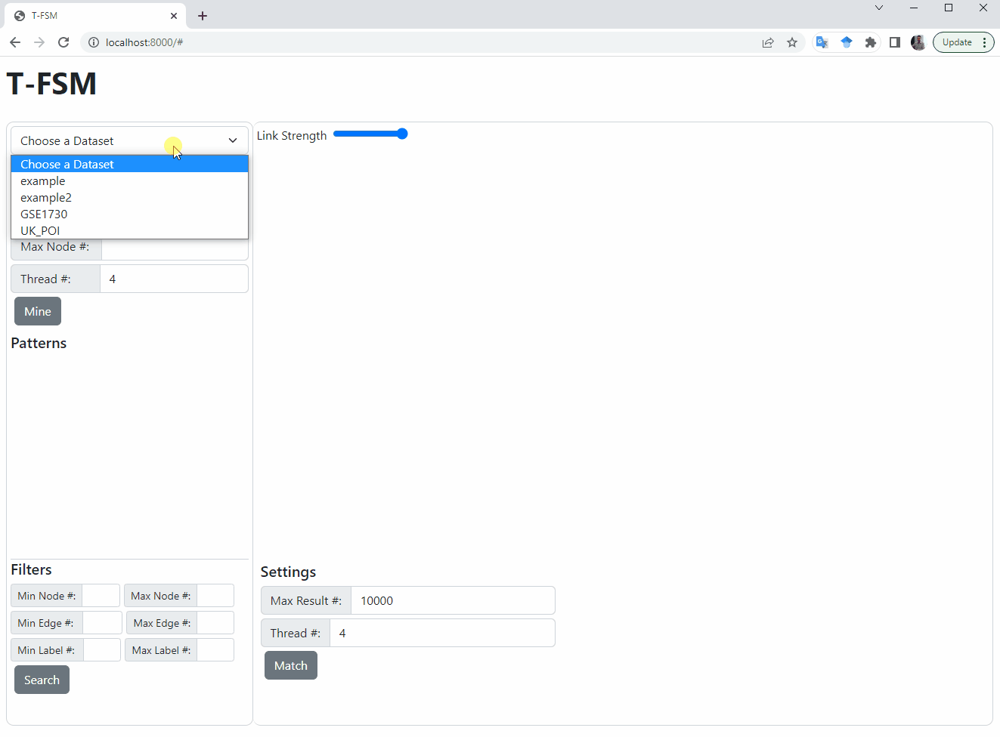

## FSM-Viewer: A User-Friendly GUI for Frequent Subgraph Pattern Mining and Instance Examination from a Big Graph

## Abstract
Finding frequent subgraph patterns in a big graph is an important
problem with many applications such as classifying chemical compounds and building indexes to speed up graph queries. Recently,
we proposed an efficient system called T-FSM for parallel mining
of frequent subgraph patterns in a big graph, whose execution
engine design ensures high concurrency, bounded memory consumption, and effective load balancing. T-FSM also supports a new
anti-monotonic frequentness measure called Fraction-Score, which
is more accurate than the widely used MNI measure.
In this demonstration, we present a novel graphical user interface on top of T-FSM, called FSM-Viewer, for users to (1) mine
frequent subgraph patterns in a big graph 𝐺 based on the selected
support measure and threshold, and view the mined patterns; and
for each matched pattern, to (2) examine its matched instances
in 𝐺 one batch at a time with additional browsing functionalities.
All patterns and matched instances are intuitively drawn as force-directed graphs to help users discover new findings.

  

  

## YouTube Demo

Click on the image below to open the YouTube video

  

